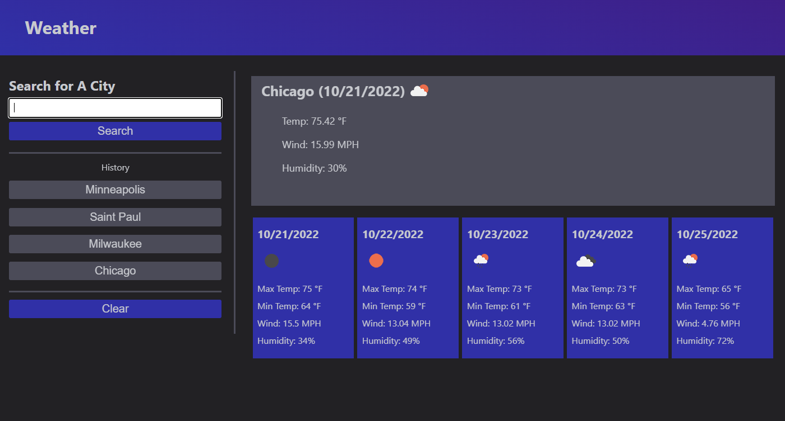
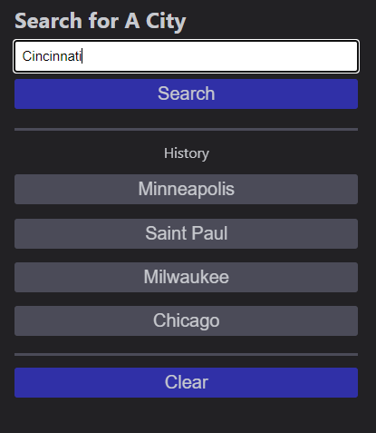
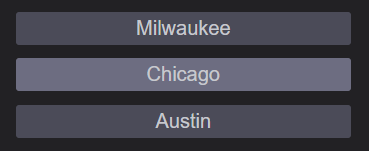
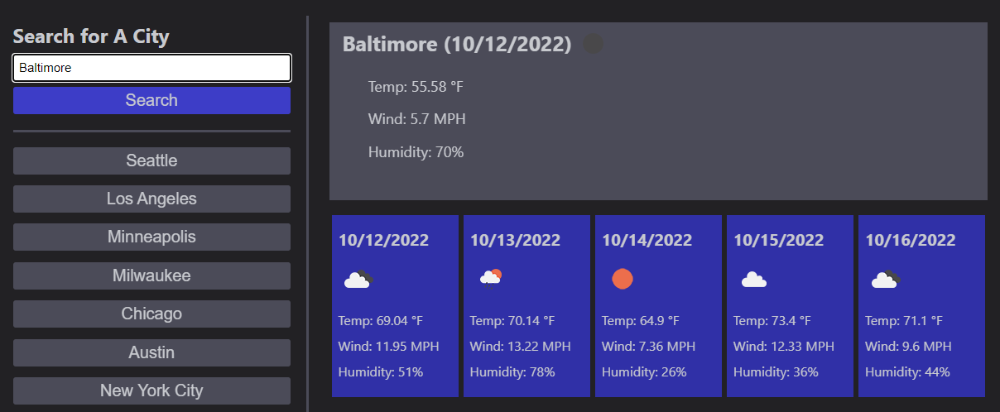
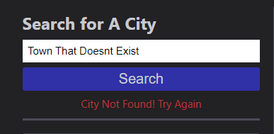

# Week 6: Dynamic Weather Tracker

## Description

For the sixth week in our Coding Bootcamp program, we were tasked with building a lightweight, but powerful weather tracker tool from the ground up by utilizing the Open Weather API. 

While the time allotted to this project was thin due to extraneous circumstances, what time could be poured into this project was insightful and engaging. The first challenge with all even numbered week challenges is the lack of any starter code, so we have to flex our drafting and iteration skills. Getting to refine the process of populating a page with placeholders that are gradually made redundant by tight Javascript is always a satisfying process. It's really beginning to feel natural starting from nothing.

Then came the challenge's major roadblock, which was having to properly use parameters to request relevant information from the API and then decipher the unwieldy JSON object we get in return. Having to work through that felt clumsy at first, but eventually you can become accustomed to each organization's own syntax. A real breakthrough came in refining the process of just console logging all the relevant information before worrying about it actually being displayed.

The search bar was another interesting challenge. The buttons could be assigned their own ID's that already had been properly encoded for URL parameters, but with user input there's only so much planning ahead that can be done. Luckily there's a command that's just right for the job, encodeURI(), which converts all invalid characters for a URL into UTF-8 encoded characters. "Los Angeles" for instance, would be converted to "Los%20Angeles".

## Installation 

N/A Already deployed on GitHub pages. https://tannerkothlow.github.io/weather-tracker/

## Usage

To use this version of the weather tracker, the user has two options to view weather data for their city of choice.

To see weather data of one of the major cities listed in the nav bar, simply click on one of the buttons and the box to the right will populate with both the current temperature, wind speed, and humidity, as well as a five day forecast.

If the city you want to know the weather for isn't listed in the navbar, you can look up weather data using the search bar. If the API finds an appropriate match, that city's weather data will be displayed.

Otherwise, it may show an error. Try to make sure you spelt everything correctly!

## License

Standard MIT license, coursework.

Weather data provided by OpenWeather (https://openweathermap.org/)
