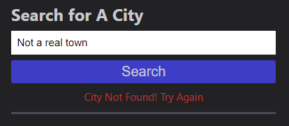

# Week 6: Dynamic Weather Tracker

## Description

(10/21/2022)
When this project was initially submitted it was missing some key features, all of which have been fully implemented in the latest update. What was previously a static list of buttons is now a list of the user's search history. There's been a number of improvements to a few calculations as well, making the weather information presented to the user more accurate and thorough. Working more with the Open Weather Map API for a group project made me much more familiar with the in's and out's of how the data is presented during a fetch request.

One challenge that presented itself while refactoring was how buttons generated by JS code need a distinct version of the jQuery "on('click')" event where the document itself is targeted, as opposed to just the button being targeted.

(10/04/2022)
For the sixth week in our Coding Bootcamp program, we were tasked with building a lightweight, but powerful weather tracker tool from the ground up by utilizing the Open Weather API. 

While the time allotted to this project was thin due to extraneous circumstances, what time could be poured into this project was insightful and engaging. The first challenge with all even numbered week challenges is the lack of any starter code, so we have to flex our drafting and iteration skills. Getting to refine the process of populating a page with placeholders that are gradually made redundant by tight Javascript is always a satisfying process. It's really beginning to feel natural starting from nothing.

Then came the challenge's major roadblock, which was having to properly use parameters to request relevant information from the API and then decipher the unwieldy JSON object we get in return. Having to work through that felt clumsy at first, but eventually you can become accustomed to each organization's own syntax. A real breakthrough came in refining the process of just console logging all the relevant information before worrying about it actually being displayed.

The search bar was another interesting challenge. The buttons could be assigned their own ID's that already had been properly encoded for URL parameters, but with user input there's only so much planning ahead that can be done. Luckily there's a command that's just right for the job, encodeURI(), which converts all invalid characters for a URL into UTF-8 encoded characters. "Los Angeles" for instance, would be converted to "Los%20Angeles".

## Installation 

N/A Already deployed on GitHub pages. https://tannerkothlow.github.io/weather-tracker/

## Usage

To use this version of the weather tracker, the user must enter a city into the search box. Upon submitting the form, the current weather data for the entered location will be shown. Underneath the current weather display is a five day forecast for the chosen location.

Once a city has been searched for, a button will be created under the history tab for that location. To view that location's weather data again, simply click on its respective.

If you have entered an invalid location, or haven't entered anything at all, a small error message will appear below the search bar.

## License

Standard MIT license, coursework.

Weather data provided by OpenWeather (https://openweathermap.org/)
